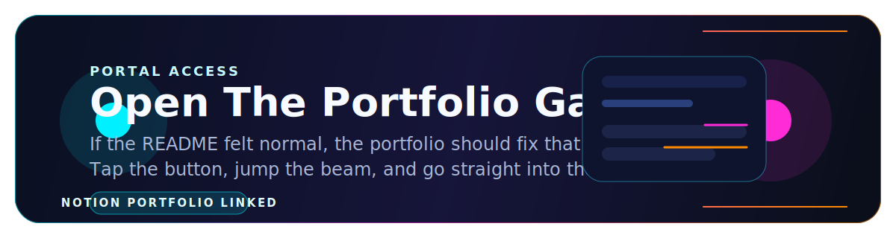
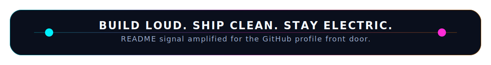

<div align="center">
  
</div>

<div align="center">
  
</div>

<div align="center">
  <a href="https://mint-middle-1e5.notion.site/2b7655e8316980ad9422d96a6f3947de" target="_blank">
    
  </a>
  <a href="https://github.com/heodongun" target="_blank">
    
  </a>
  
</div>

<div align="center">
  <a href="mailto:heodongun08@gmail.com">
    
  </a>
  <a href="https://velog.io/@pobi/posts" target="_blank">
    
  </a>
  <a href="https://www.linkedin.com/in/%EB%8F%99%EC%9A%B4-%ED%97%88-ab2b6135b/" target="_blank">
    
  </a>
  <a href="https://www.threads.com/@heodongun0922" target="_blank">
    
  </a>
</div>

<div align="center">
  
</div>

<br />

<div align="center">
  
  
  
  
</div>

## Identity Core

> "일상의 귀찮음을 코드로 해결하는 개발자"

<div align="center">
  
  
  
</div>

<table>
  <tr>
    <td width="50%">
      
    </td>
    <td width="50%">
      
    </td>
  </tr>
</table>

<div align="center">
  
</div>

<div align="center">
  
</div>

<div align="center">
  <a href="https://mint-middle-1e5.notion.site/2b7655e8316980ad9422d96a6f3947de" target="_blank">
    
  </a>
</div>

## About Me

🔥 **필요하다면 무엇이든 합니다.**

백엔드 개발을 중심으로 AI, 인프라, 자동화 등 다양한 영역을 넘나들며 문제를 해결합니다. 단순한 기능 구현을 넘어, 서비스의 지속 가능성과 사용자 경험을 고민하는 개발자가 되는 것을 목표로 합니다.

- 🎓 부산소프트웨어마이스터고등학교 수석입학 (2024.03.10)
- 💼 플레이버니즈 AI/서버 개발 인턴 (2025.07 ~ 2025.08)
- 💼 온더룩 개발팀 인턴 근무 (2026.01 ~ 2026.03)
- 📞 010-5132-8318
- ✉️ heodongun08@gmail.com

## Awards

### 2025
- 🥉 `2025.11.06` 소마고 연합 해커톤 장려상
- 🏆 부경대 우수토론자
- 🥉 조정 3등
- 🥉 `2025.02.11` 산호세 주립대학교 AI캠프 장려상

### 2024
- 🥉 `2024.12.24` 교내 네트워크 대회 장려상
- 🥈 `2024.12.10` 교내 디자인 대회 2등
- 🥉 영어 말하기 대회 장려상
- 🥉 독후감 대회 장려상
- 🥉 `2024.11.27` PKNU AISW 부우산 지역문제대회 장려상
- 🥈 `2024.09.05` 2024 교내 AI SW 공모전 2등
- 🥇 `2024.03.10` 부산소프트웨어마이스터고등학교 수석입학

## Certifications

- 🏅 `2024.11.11` TOPCIT 3수준 취득
- 🏅 `2025.06.27` SQLD 취득
- 🏅 `2025.07.16` 정보처리산업기사 취득

## Activities

- `2024.09.10 ~ 2024.09.12` AI KOREA 2024 학교 대표 프로젝트 BEXCO 부스 운영
- `2024.11.03 ~ 2024.11.07` 대한민국 SW 교육 페스티벌 학교 대표 부스 운영
- `2024.11.27` PKNU AISW 부우산 지역문제대회 부경대 부스 운영
- `2024.12.19 ~` 교내 지식 봉사 동아리 플로이테크코스 팀장
- `2025.01.08` 교내 기술 컨퍼런스 부마콘 2025 주최 및 연사 — "자기의심을 극복하는 방법"
- `2025.02 ~ 2025.03` Elice AI Spark Camp 수료
- `2025.03.13 ~ 2025` 부산소프트웨어마이스터고 학생회 마이스터부 차장
- `2026` 부산소프트웨어마이스터고 학생회 마이스터부 부장
- `2025.03.13 ~` NDIE 비영리단체 지원 프로젝트 팀장
- `2025.05.01 ~ 2025.05.30` 산호세 주립대학 프로젝트 팀FOCUS 팀장
- `2025.09.09` 비디아 학교 대표 전시 부스 운영
- `2025.11.13 ~ 2025.11.16` 지스타 학교 대표 전시 부스 운영
- `2026.03.04 ~` 학교 공식 오픈소스 단체 [BSSM-OSS](https://github.com/bssm-oss) 운영

## Experience

- `2025.07 ~ 2025.08` 플레이버니즈 AI/서버 개발 인턴
- `2026.01 ~ 2026.03` 온더룩 개발팀 인턴 근무

## Project Orbit

### 🚀 Cotor
> 사이드 프로젝트를 혼자 운영하는 한계를 줄이기 위해 만든, 24시간 돌아가는 로컬 우선 AI 회사

개발, 테스트, 문서, 홍보, 유지보수처럼 계속 밀리는 일을 AI 직원들이 역할을 나눠 처리하고, 사용자는 방향과 기준을 정하는 데 집중할 수 있게 만든 시스템입니다. 비용 문제는 Gemma 4 같은 로컬 모델과 무료/저비용 모델을 우선 쓰는 방식으로 해결했습니다.

- **핵심 기술:** Kotlin, Coroutines, DAG 실행 엔진, Ktor, SwiftUI, Git worktree/branch isolation, A2A evidence
- **GitHub:** [bssm-oss/cotor](https://github.com/bssm-oss/cotor)
- **문서:** [README.ko](https://github.com/bssm-oss/cotor/blob/master/docs/README.ko.md)
- **DeepWiki:** [deepwiki.com/bssm-oss/cotor](https://deepwiki.com/bssm-oss/cotor)

### 🍽️ Allergic
> 음식 사진 한 장으로 알레르기 성분을 확인해주는 서비스

사용자가 음식 사진을 찍으면 ChatGPT API와 연동하여 음식 성분을 분석하고, 사용자가 등록한 알레르기 정보와 비교해 알레르기 유발 성분 포함 여부를 판단하고 경고해주는 앱입니다. 교내 AI 공모전 2등🥈 수상, AI KOREA 2024 학교 대표 프로젝트로 선정되어 BEXCO 부스 운영, 행복한교육 겨울호 게재 등의 성과를 거뒀습니다.

- **핵심 기술:** Node.js, Express.js, MongoDB, ChatGPT API, YoloV5, Google Cloud Storage
- **GitHub:** [allergicyujin](https://github.com/allergicyujin)
- **회고:** [Velog](https://velog.io/@pobi/%EC%95%8C%EB%9F%AC%EC%A7%81%EC%9D%98-%EB%AA%A9%EC%A0%81%EC%A7%80%EB%8A%94-%EC%84%9C%EC%9A%B8)

### ⚡ UPIK
> 포트폴리오의 또 다른 주요 프로젝트

(상세 내용은 [포트폴리오](https://mint-middle-1e5.notion.site/2b7655e8316980ad9422d96a6f3947de)에서 확인하실 수 있습니다.)

## Tech Storm

<div align="center">
  
  
  
  
  
  
  
  
  
  
  
  
  
  
</div>

## Hyper Deck

```bash
> whoami
허동운 | heodongun

> mode
portfolio-first / backend-operator / visual-overdrive

> mission
solve everyday friction with code

> portal
https://mint-middle-1e5.notion.site/2b7655e8316980ad9422d96a6f3947de
```

<div align="center">
  
  
  
</div>

<table>
  <tr>
    <td width="33%">
      <h3 align="center">Signal</h3>
      <p align="center">Portfolio, writing, and career signal live in the first screen, not hidden below the fold.</p>
    </td>
    <td width="33%">
      <h3 align="center">Energy</h3>
      <p align="center">Gradients, glow, motion, trophies, graphs, and oversized calls-to-action are all intentional.</p>
    </td>
    <td width="33%">
      <h3 align="center">Impact</h3>
      <p align="center">The page says exactly who I am, what I build, and where to see the work in one glance.</p>
    </td>
  </tr>
</table>

## Warp Link

<div align="center">
  <a href="https://mint-middle-1e5.notion.site/2b7655e8316980ad9422d96a6f3947de" target="_blank">
    
  </a>
</div>

<div align="center">
  
</div>
